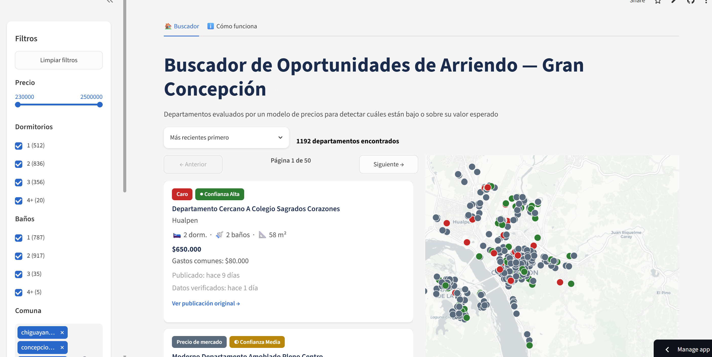

# Gran Concepción Rentals

## Resumen ejecutivo

Pipeline completo de datos —desde scraping hasta modelamiento— para estimar el **costo total
mensual** (arriendo + gastos comunes) de **departamentos** en las comunas del Gran Concepción
(Chile) y detectar avisos publicados por debajo o por encima de lo que el mercado local
justifica. El target es el costo total y no solo el arriendo nominal porque los gastos comunes
varían de forma significativa entre propiedades comparables, y esa diferencia puede cambiar
sustancialmente qué tan buen negocio es un arriendo (ver sección 3.6). El approach: scraping
propio de Portal Inmobiliario cruzado con un índice de vulnerabilidad socioterritorial,
ingeniería de variables con selección estadística por estabilidad (SHAP + bagging + K-Fold), y
comparación de XGBoost vs. LightGBM sobre las mismas 29 features, todo respaldado por un
pipeline de producción independiente (cron + base propia) y un dashboard Streamlit. El modelo de
producción vigente (**LightGBM**) logra **MAE 61.470 CLP / MAPE 10.05% / R² 0.80** en test — una
reducción de MAE del 57% frente al baseline de media de train y del 34% frente a un "costo total
de mercado ingenuo" (costo total/m² × superficie).



**[gran-concepcion-arriendos-departamentos.streamlit.app](https://gran-concepcion-arriendos.streamlit.app/)**
— explora las predicciones y etiquetas sobre los avisos vigentes.

---

## 1. Arquitectura del pipeline

El repo separa dos mundos: `investigacion/` (etapas 01-04, donde se scrapea, exploran y entrenan
los modelos candidatos) y `produccion/` (pipeline independiente que corre solo, con su propia base
de datos, más el dashboard). Ver sección 2 para el porqué de esta separación y sección 9 para el
detalle del pipeline de producción.

```
investigacion/
  01_obtener_datos/
    01_scraper_grilla.py                  → tabla `avisos`               (requests + BeautifulSoup)
    02_scraper_detalle.py                 → tabla `avisos_detalle`       (requests; Playwright solo como respaldo)
    03_vulnerabilidad_socioterritorial.py → tablas `vulnerabilidad_uv`,
                                             `avisos_igvust`               (geopandas, cruce espacial)
          │  (todo persiste en avisos_gran_concepcion.db, SQLite)
          ▼
  02_analisis_exploratorio/
    01_EDA.ipynb                          → exploración manual de los datos crudos
          ▼
  03_ingenieria_variables/
    01_ingenieria_variables.py            → datos_ingenieria_variables.csv (1.627 filas × 45 columnas,
                                             target = costo_total_clp = precio_clp + gastos_comunes)
    02_seleccion_variables.py             → selected_features.csv          (29 features finales)
          ▼
  04_modelamiento/
    01_xgboost.py          → bagging ×10 + etiquetado oportunidad/caro
    02_lightgbm.py         → bagging ×10 + etiquetado oportunidad/caro (misma API que 01_xgboost.py)

produccion/
  01_modelo_produccion/   → pipeline de producción, separado e independiente (sección 9)
    entrenamiento/seleccionar_algoritmo.py         → compara xgboost vs lightgbm (JSON de métricas
                                                      de investigación) y elige el algoritmo ganador
    entrenamiento/01_entrenar_modelo_produccion.py → entrena el algoritmo ganador, modelo versionado
                                                      (85/15 + calibración)
    00_orquestador.py                              → corre las etapas 1-5 de abajo en orden
    01_scraper_grilla_incremental.py               → tabla `avisos`          (produccion_gran_concepcion.db)
    02_scraper_detalle_incremental.py              → tabla `avisos_detalle` + estado_publicacion
    03_vulnerabilidad_produccion.py                → columnas de vulnerabilidad en `avisos_detalle`
    04_ingenieria_variables_produccion.py          → features de avisos nuevos (contra referencia histórica)
    05_prediccion.py                               → tabla `predicciones` (costo total predicho + etiqueta + confianza)
          │  (produccion_gran_concepcion.db, solo lectura desde acá en adelante)
          ▼
  02_pruebas/             → prototipos/validación manual sobre el modelo de producción (no es pipeline)
  03_visualizacion/       → dashboard Streamlit, sección 10
    app.py                → tarjetas filtrables + mapa (st.tabs: Buscador / Cómo funciona)
```

Cada script ancla sus rutas de entrada/salida a la ubicación del propio archivo (no al
directorio de trabajo actual), por lo que pueden ejecutarse desde la raíz del repo o desde su
propia carpeta indistintamente. Los scripts de `produccion/` que reutilizan lógica de
`investigacion/` (vía `importlib`, ya que los nombres empiezan con dígitos) cruzan ese límite
apuntando explícitamente a `investigacion/...` desde su propia ubicación — ver sección 9.

La base de datos SQLite (`investigacion/01_obtener_datos/avisos_gran_concepcion.db`, ~4 MB) **está
versionada en el repo**, ya con los datos scrapeados y las tablas de vulnerabilidad resueltas — no
hace falta correr los scrapers desde cero para reproducir la ingeniería de variables y el
modelamiento (ver [Quick start](#12-quick-start)).

> El pipeline de modelamiento trabaja exclusivamente sobre **departamentos**. Los scrapers de
> **investigación** (`investigacion/01_obtener_datos/`) sí recolectan casas, pero la etapa de
> ingeniería de variables filtra y trabaja solo con `tipo_propiedad = "departamento"`. El scraper
> de grilla de **producción** va un paso más allá y directamente **no recorre casas**, ya que el
> resto del pipeline de producción las descartaría de todas formas — evita gastar presupuesto de
> scraping en avisos que nunca generan features ni predicción (ver
> [CHANGELOG.md](CHANGELOG.md#producción-dejar-de-scrapear-casas)).

---

## 2. Estructura de carpetas

El repo separa `investigacion/` (etapas 01-04: scraping de investigación, exploración,
ingeniería de variables y comparación de modelos candidatos) de `produccion/` (pipeline
independiente que corre solo vía cron, más el dashboard) — dos mundos con una sola base de datos
de investigación (`avisos_gran_concepcion.db`, versionada) y una de producción
(`produccion_gran_concepcion.db`, actualizada por el orquestador). Los scripts de `produccion/`
reutilizan funciones de `investigacion/` vía `importlib` (sección 9) en vez de duplicar lógica de
parsing/extracción; los nombres de carpeta dentro de `produccion/` se renumeraron de 01 a 03 al
separarla de `investigacion/`, ya que dejó de ser continuación secuencial de la numeración 01-04.

```
gran-concepcion-rentals/
├── investigacion/
│   ├── 01_obtener_datos/
│   │   ├── 01_scraper_grilla.py
│   │   ├── 02_scraper_detalle.py
│   │   ├── 03_vulnerabilidad_socioterritorial.py
│   │   ├── avisos_gran_concepcion.db          # SQLite, versionado en el repo
│   │   └── datos_vulnerabilidad/              # shapefile IGVUST, NO versionado (.gitignore)
│   │
│   ├── 02_analisis_exploratorio/
│   │   └── 01_EDA.ipynb
│   │
│   ├── 03_ingenieria_variables/
│   │   ├── 01_ingenieria_variables.py
│   │   ├── 02_seleccion_variables.py
│   │   └── save/
│   │       ├── ingeniaria_variables/
│   │       │   ├── datos_ingenieria_variables.csv
│   │       │   ├── niveles_barrio.json
│   │       │   └── modelos_superficie/*.pkl   # RandomForest de IMPUTACIÓN de superficie (no es el
│   │       │                                  # modelo de precio, ver sección 3.4)
│   │       └── seleccion_variables/
│   │           ├── selected_features.csv
│   │           └── seleccion_variables_reporte.json
│   │
│   └── 04_modelamiento/
│       ├── 01_xgboost.py
│       ├── 02_lightgbm.py
│       └── save/model/
│           ├── xgboost_regression_precio.pkl               # ensamble de 10 modelos
│           ├── xgboost_regression_precio_metrics.json
│           ├── xgboost_regression_precio_oportunidades_*.csv
│           ├── lightgbm_regression_precio.pkl
│           ├── lightgbm_regression_precio_metrics.json
│           └── lightgbm_regression_precio_oportunidades_*.csv
│
└── produccion/
    ├── 01_modelo_produccion/          # pipeline de producción, sección 9
    │   ├── db.py                                    # esquema + conexión a produccion_gran_concepcion.db
    │   ├── 00_orquestador.py                        # corre las etapas de abajo en orden, logging + alertas
    │   ├── 01_scraper_grilla_incremental.py
    │   ├── 02_scraper_detalle_incremental.py
    │   ├── 03_vulnerabilidad_produccion.py
    │   ├── migrar_poligonos_vulnerabilidad.py       # migración manual/local: shapefile -> tabla poligonos_vulnerabilidad_uv
    │   ├── 04_ingenieria_variables_produccion.py
    │   ├── 05_prediccion.py
    │   ├── requirements.txt                         # dependencias pineadas para GitHub Actions (sin geopandas ni playwright)
    │   ├── produccion_gran_concepcion.db            # SQLite, propia de este pipeline
    │   ├── logs/orquestador.log                     # log rotativo (RotatingFileHandler)
    │   └── entrenamiento/
    │       ├── seleccionar_algoritmo.py             # compara xgboost vs lightgbm, elige ganador
    │       ├── algoritmo_seleccionado.json          # decisión persistida (algoritmo + métricas)
    │       ├── 01_entrenar_modelo_produccion.py     # entrena el algoritmo ganador
    │       ├── version_modelo.json                  # contador + historial de versiones
    │       └── versiones/{version}/
    │           ├── modelo_produccion.pkl
    │           └── parametros_produccion.json
    │
    ├── 02_pruebas/                     # prototipos/validación manual, no forma parte del pipeline
    │   └── prototipo_prediccion_manual.py
    │
    └── 03_visualizacion/               # dashboard Streamlit, sección 10
        ├── app.py                                   # entrypoint: st.tabs (Buscador / Cómo funciona)
        ├── data.py                                  # query + join + estandarización de precio
        ├── filters.py                               # sidebar de filtros + lógica de filtrado
        ├── components.py                            # tarjetas de aviso + mapa folium
        ├── explicacion.py                           # contenido de la pestaña "Cómo funciona"
        ├── styles.py                                # paleta de colores + CSS compartido
        ├── requirements.txt
        └── .streamlit/config.toml                   # tema forzado a claro
```

---

## 3. Calidad de datos e ingeniería de variables

### 3.1 Fuga de datos en `precio_m2`

El hallazgo más significativo del proyecto fue detectar **fuga de datos (data leakage)** en una
primera versión de la variable de precio/m² de sector: se calculaba usando el precio de la
**propia fila** del aviso, lo que producía un MAPE artificialmente bajo (~3.6%) — una señal de
alerta, no de buen desempeño, ya que el modelo estaba viendo (indirectamente) la respuesta que
debía predecir.

La corrección, implementada en `agregar_precio_m2_sector`
(`investigacion/03_ingenieria_variables/01_ingenieria_variables.py`), calcula el precio/m² de cada aviso
usando **solo comparables de OTRAS propiedades** dentro de un radio de 300 metros (excluyendo la
fila propia), con:
- filtro de outliers vía IQR (multiplicador ×3) sobre el precio/m² del sector antes de promediar,
- mediana (no promedio) de los vecinos válidos,
- fallback a la mediana general del grupo cuando no hay vecinos cercanos válidos, marcado
  explícitamente en la columna `tiene_comparables_cercanos` para distinguir ese caso de un
  vecindario real con valor bajo.

Esta variable corregida (`precio_m2_sector_departamento`) sí es una de las 29 features finales
del modelo — la diferencia crítica es que su fuente son los vecinos, nunca la propia fila. Desde
el cambio de target a costo total (sección 3.6), el precio/m² auxiliar usado acá se calcula sobre
`costo_total_clp` (arriendo + gastos comunes), no solo sobre `precio_clp`, para que el
comparador de mercado quede en la misma escala que lo que el modelo predice.

### 3.2 Scraping: arquitectura y decisiones

- **Dos scrapers separados**: `01_scraper_grilla.py` recorre las páginas de resultados de
  búsqueda (requests + BeautifulSoup, sin navegador), y `02_scraper_detalle.py` visita cada
  aviso individual (también requests) para extraer descripción, características y puntos de
  interés cercanos.
- **Migración de Playwright a `requests`** (confirmada equivalente con 6 URLs comparadas 1:1 y
  una corrida de 150 requests sin señales de bloqueo): el HTML servido ya trae server-side el
  mismo JSON/texto que renderizaba Playwright. Se conservó como **ruta de respaldo**
  (`--fallback-playwright`, import perezoso) para el caso de bloqueo persistente o para resolver
  un CAPTCHA a mano.
- **Guardado incremental y reanudable**: commit inmediato por página/aviso, `INSERT OR IGNORE`
  sobre `id_aviso`, y un `LEFT JOIN` para retomar solo los avisos pendientes de detalle.
- **Corte temprano por duplicados**: si una página completa de resultados ya existía en la base,
  se corta esa búsqueda y se pasa a la siguiente combinación comuna/tipo.
- **POIs vía JSON embebido** (`window._n.ctx.r`, no el HTML visible): trae todas las categorías
  completas aunque el usuario no haya abierto esa pestaña. "Cercano" = dentro de 500 metros.
- **Mitigaciones de bloqueo**: delays variables entre requests, reintento con backoff ante fallos
  aislados, y detección de CAPTCHA por **doble condición** (la palabra "captcha" en el HTML **Y**
  el contenido normal no cargó) para no confundir con el reCAPTCHA de fondo casi siempre
  presente.
- **Fallos persistentes entre corridas**: un contador (`intentos_fallidos_detalle`) suma en cada
  fallo y se resetea en éxito; tras 5 fallos consecutivos el aviso se marca
  `estado_publicacion = 'no_disponible'` y sale de la cola de pendientes.
- **Bug corregido: `avisos_detalle.banos` capturaba la superficie, no los baños.** El regex
  original (con `re.IGNORECASE`) encontraba primero la insignia superior de la página ("2
  baños\n75 m² totales") en vez de la sección de características ("Baños\n2"), capturando la
  superficie en vez de los baños reales. Afectó ~48% de las filas (851 de 1782); corregido y con
  backfill retroactivo sobre la base. El feature `banos` que usa el modelo siempre vino de
  `avisos.banos` (grilla, con un regex distinto que nunca tuvo este problema), así que ningún
  modelo entrenado quedó afectado.

### 3.3 El bug de `gastos_comunes` (impacto medible en el modelo)

**Qué pasó**: `gastos_comunes` perdía el separador de miles chileno — `"82.000"` se interpretaba
como `82.0` en vez de `82000.0` — por usar `float()` directo sobre el texto crudo, sin manejar el
punto como separador de miles. Afectaba **1411 de 1956 avisos del histórico (72%)**.

**Cómo se detectó y corrigió**: al revisar la extracción se identificaron tres casos según el
texto crudo — **con punto** (separador de miles real: se limpia y convierte, `"82.000"` →
`82000.0`), **dígito suelto < 1.000 sin punto** (placeholder de "gastos comunes incluidos en el
arriendo" que el sitio muestra cuando el campo no puede quedar vacío — confirmado contra el HTML
en vivo — se mapea a `0.0`), y **sin punto y ≥ 500.000** (outlier implausible, se descarta a
`NULL`). Se agregó además un fallback de extracción sobre la insignia de resumen ("Gastos
comunes desde $X"), verificado en vivo, que recuperó 102 de los 190 avisos con el campo `NULL`.

**Impacto en las métricas** (Test, antes/después del fix + reentrenamiento — detalle fila por
fila del backfill en
[CHANGELOG.md](CHANGELOG.md#backfill-de-gastos_comunes-reclasificación-fila-por-fila)):

| Métrica | XGBoost antes | XGBoost después | LightGBM antes | LightGBM después |
|---|---:|---:|---:|---:|
| MAE | 50.981 | 49.237 | 50.058 | 48.901 |
| RMSE | 77.646 | 74.455 | 74.359 | 73.890 |
| R² | 0.8250 | 0.8391 | 0.8395 | 0.8416 |
| MAPE | 8.94% | 8.65% | 8.74% | 8.57% |
| MdAPE | 6.85% | 6.50% | 6.67% | 6.16% |

Ambos algoritmos mejoraron en las cinco métricas de test tras la corrección. `gastos_comunes` se
mantuvo entre las features más estables (`stability_score=0.97`, top 6) en la re-selección de
variables **de esa corrida** (con `precio_clp` como target). El detalle completo del backfill
(reclasificación fila por fila, incidente de sincronización durante la migración a producción,
etc.) está en [CHANGELOG.md](CHANGELOG.md).

> **Actualización (jul-2026)**: `gastos_comunes` ya **no** es una feature de entrada del modelo —
> ver sección 3.6. Se convirtió en uno de los dos sumandos del target (`costo_total_clp`), así
> que usarla como feature sería fuga de datos. El bug y su corrección documentados arriba
> (calidad del dato) siguen totalmente vigentes: `gastos_comunes` limpio es justamente lo que
> ahora alimenta `costo_total_clp` en vez de alimentar al modelo como columna aparte.

### 3.4 Limpieza y conversión de datos

- **Conversión UF → CLP** vía la API de `mindicador.cl`, con caché de valores de UF en una tabla
  SQLite (`valores_uf`) para no repetir consultas entre corridas.
- Corrección de formato numérico chileno (separador de miles) al parsear distancias y precios.
- Filtros de valores imposibles en dormitorios, baños y estacionamientos (probables errores de
  digitación).
- **Imputación de superficie corrupta** (bajo un umbral mínimo o faltante) con un
  `RandomForestRegressor` entrenado por tipo de propiedad, persistido en `.pkl` para reutilizarse
  sin reentrenar.
- **Imputación de antigüedad** por cercanía geográfica (mediana de vecinos dentro de 200 m del
  mismo tipo de propiedad), con una cascada de fallbacks (mediana por tipo → por comuna → global)
  calculados siempre sobre los valores originales, nunca sobre estimaciones previas.
- **Filtro de outliers de precio** vía un tope máximo de `precio_clp` (8.000.000 CLP): por encima
  de ese nivel se asume que son ventas mal clasificadas como arriendo, no arriendos reales.

### 3.5 Variables derivadas

- Distancias vía **fórmula de Haversine** (al centro de la propia comuna y al centro de
  Concepción).
- **`nivel_barrio`**: precio/m² promedio por barrio, suavizado hacia la media general (k=20
  "avisos virtuales") y agrupado en 5 niveles usando **cuantiles ponderados por cantidad de
  avisos** (no por cantidad de barrios), para que "alto" represente realmente ~20% de las
  propiedades más caras.
- **`precio_m2_sector_departamento`**: ver [3.1](#31-fuga-de-datos-en-precio_m2) — comparables
  reales cercanos (300 m), excluyendo la propia fila.
- **`ratio_total_util`**: superficie total / superficie útil, como proxy de cuánta superficie
  común/no habitable tiene la propiedad.

### 3.6 Cambio de target: costo total mensual (arriendo + gastos comunes)

**Motivación**: se observaron diferencias significativas en `gastos_comunes` entre propiedades
comparables (mismo sector, superficie y características similares) — en esos casos, el costo
adicional puede cambiar sustancialmente qué tan buen negocio es un arriendo. Un departamento con
arriendo más barato pero gastos comunes altos puede terminar costando más al mes que uno con
arriendo más caro y gastos comunes bajos. El modelo original solo evaluaba `precio_clp` (el
arriendo nominal), ignorando esa diferencia.

**Qué cambió** (`agregar_costo_total` en `01_ingenieria_variables.py`):

- Nueva columna `costo_total_clp = precio_clp + gastos_comunes`, calculada después del filtro de
  precio máximo (que sigue evaluando solo `precio_clp`, ya que ese filtro detecta ventas mal
  clasificadas como arriendo — un problema del precio pactado, no de los gastos comunes) y **antes**
  de `nivel_barrio`/`precio_m2_sector_departamento`, que ahora se calculan sobre costo total en vez
  de solo arriendo (secciones 3.1 y 3.5).
- `precio_clp` se conserva en el dataset como columna informativa/de auditoría, pero **ya no es
  target ni feature**.
- `gastos_comunes` **deja de ser feature de entrada** (sección 3.3): pasó a ser uno de los dos
  sumandos del target, así que usarla como predictora sería fuga de datos casi perfecta
  (`costo_total_clp − gastos_comunes = precio_clp`). `02_seleccion_variables.py` excluye
  explícitamente `gastos_comunes` y `precio_clp` de las candidatas a feature.
- Selección de variables, XGBoost, LightGBM y el modelo de producción se reentrenaron sobre el
  nuevo target (ver secciones 6, 7 y 9). El sistema de etiquetado oportunidad/caro (sección 8) y
  su calibración (deciles, mediana/MAD por decil, terciles de CV) se recalcularon sobre
  `costo_total_clp` — no son comparables en magnitud contra las corridas anteriores basadas en
  `precio_clp`.
- En producción, `05_prediccion.py` compara el costo total real del aviso
  (`precio_clp_real + gastos_comunes_real`) contra el costo total predicho, y la tabla
  `predicciones` renombró su columna `precio_predicho` a `costo_total_predicho` (sección 9.2).

---

## 4. Features del modelo final (29)

Seleccionadas por `investigacion/03_ingenieria_variables/02_seleccion_variables.py` a partir de 41 features
candidatas (ver sección 6 para la metodología de selección). Target = `costo_total_clp`
(arriendo + gastos comunes, sección 3.6); `gastos_comunes` y `precio_clp` se excluyen
explícitamente de las candidatas por ser fuga de datos hacia el target. Mismas 29 features para
XGBoost y LightGBM (ambos se comparan sobre exactamente el mismo set, ver sección 7).

**Características físicas de la propiedad**
- `superficie_util_m2`, `superficie_total_m2`, `ratio_total_util`
- `banos`, `estacionamientos`, `bodegas`, `piso_unidad`, `ascensor`,
  `piscina`, `amoblado`, `conserjeria`, `condominio_cerrado`
- `antiguedad_anos`

**Ubicación y mercado local**
- `precio_m2_sector_departamento` (costo total/m² de comparables cercanos, ver secciones 3.1 y
  3.6 — ya no es solo arriendo/m²)
- `tiene_comparables_cercanos` (flag de confiabilidad del anterior)
- `nivel_barrio` (costo total/m² suavizado por barrio, ver secciones 3.5 y 3.6)
- `distancia_centro_concepcion_m`, `distancia_centro_comuna_m`
- `cantidad_paraderos`, `cantidad_colegios`, `cantidad_supermercados`,
  `cantidad_jardines_infantiles`, `cantidad_universidades`, `cantidad_plazas`,
  `cantidad_farmacias`, `cantidad_clinicas`

**Contexto socioeconómico del sector (índice IGVUST / Registro Social de Hogares, por Unidad
Vecinal)**
- `rank_nac` (ranking nacional de vulnerabilidad de la Unidad Vecinal)
- `hog_uv` (hogares registrados en el RSH de la Unidad Vecinal)
- `p_urbano` (porcentaje urbano de la Unidad Vecinal)

> `gastos_comunes` **no** aparece en esta lista — dejó de ser feature de entrada al pasar a ser
> uno de los dos sumandos del target (sección 3.6). `estacionamiento_visitas`,
> `cantidad_centros_comerciales`, `pob_rsh_uv` y `c_ig_com` (features del modelo anterior) no
> quedaron entre las 29 finales de esta corrida; `hog_uv` y `cantidad_universidades` sí, y no
> estaban en la selección anterior.

---

## 5. Evolución del modelamiento

El proyecto pasó por dos etapas de modelamiento. La **etapa inicial** usó un modelo base de
árboles evaluado con MAE/RMSE/R²/MAPE (la razón RMSE/MAE, como diagnóstico de concentración de
error en casos extremos, mejoró de ~2.7 a ~2.1 tras la limpieza de datos), probó
`log(precio_clp)` como target (descartado, sin mejora) y revisó manualmente los casos de error
más extremo para descartar errores de datos frente a variabilidad genuina de mercado.

La **etapa de refinamiento** (la que definió la versión final, en `investigacion/04_modelamiento/`) introdujo:

- **Split estratificado por quintil de precio**, en reemplazo de un split aleatorio simple que
  mostraba inestabilidad severa entre corridas.
- **Selección de variables por estabilidad** (SHAP + 30 modelos + K-Fold + regla de 1 error
  estándar — ver sección 6), en vez de depender de la importancia de un único modelo.
- **Objective/criterion fijado manualmente** (no como hiperparámetro de Optuna) en los tres
  algoritmos probados, tras detectar que dejarlo en el espacio de búsqueda generaba inestabilidad
  entre corridas (el "ganador" cambiaba por ruido de los folds, no por diferencia real de
  desempeño).
- **Validación multi-semilla** (8 particiones con split estratificado, Optuna completo en cada
  una) para confirmar que las métricas del modelo final no dependen de una partición con suerte
  — no se ejecuta automáticamente por su costo computacional, está disponible para correrse
  aparte.
- Se **volvió a probar `log(precio_clp)`** con el pipeline ya mejorado, y se descartó otra vez
  por empeorar todas las métricas (incluida la kurtosis de los residuos) — confirmando con
  metodología más rigurosa la misma conclusión de la etapa inicial.
- **Comparación de dos arquitecturas** (XGBoost, LightGBM, ver sección 7). Random Forest se probó
  en una etapa anterior (con menos features y datos sin corregir) y quedó consistentemente por
  debajo de las otras dos, por lo que se eliminó del pipeline para simplificarlo.
- Se **descartó separar el modelo en "premium vs. resto"**: el MAPE del quintil más caro (Q5) no
  es dramáticamente peor que el resto de los quintiles (ver sección 7), por lo que el problema
  real es volumen de datos en ese segmento, no una estructura de precios distinta.

> **Nota**: `crear_variables_derivadas` (ratios por dormitorio, índice de amenities,
> interacciones ubicación-superficie, `valor_mercado_estimado_sector`, etc.) está implementada en
> `01_ingenieria_variables.py` pero **deshabilitada** en el pipeline actual — se probó, pero no
> hay evidencia confirmada en el código de que aporte mejora real frente al ruido de partición.
> Del target transform log tampoco queda rastro activo en el código actual, consistente con que
> la conclusión fue descartarlo.

Una tercera etapa (jul-2026) cambió el target de `precio_clp` (arriendo nominal) a
`costo_total_clp` (arriendo + gastos comunes) — ver sección 3.6 para la motivación y el detalle
del cambio, y secciones 6-9 para las corridas de selección de variables, modelamiento y
producción reentrenadas sobre el nuevo target.

---

## 6. Selección de variables (metodología)

`investigacion/03_ingenieria_variables/02_seleccion_variables.py` reduce 41 features candidatas
(45 columnas del CSV, menos `id_aviso`, el target `costo_total_clp`, y `precio_clp`/
`gastos_comunes` excluidas explícitamente por fuga de datos hacia el target — sección 3.6) a las
29 finales en 4 pasos:

1. **Eliminación de constantes**: features con varianza ≈ 0 sobre train. En la corrida
   registrada, se eliminó `quincho` (varianza cero) — quedan 40 candidatas.
2. **Selección por estabilidad**: se entrenan 30 modelos XGBoost con K-Fold aleatorio (5 folds,
   semillas distintas), midiendo importancia SHAP (TreeSHAP nativo) de cada feature en cada
   fold. `stability_score = (1 / (1 + CV)) × presence_pct`, donde CV es el coeficiente de
   variación de la importancia entre modelos y `presence_pct` el % de modelos donde la
   importancia fue > 0.
3. **Selección de k óptimo vía MAE de validación**: se evalúa la curva MAE/RMSE/R² en el set de
   validación para k features (ordenadas por `stability_score`), promediando sobre 5 semillas, y
   se aplica la **regla de 1 error estándar** (el k más chico cuyo MAE promedio cae dentro de 1
   SE del mínimo) — resultado: **k=30**.
4. **Red de seguridad de correlación**: elimina pares de features con correlación > 0.95 entre
   las ya seleccionadas, quedándose con la de mayor `stability_score`. En la corrida registrada
   eliminó `pob_rsh_uv` (1 de 30), dejando las **29 features finales**.

---

## 7. Modelos comparados y selección de algoritmo

Los dos modelos comparten exactamente las mismas 29 features, target `costo_total_clp` (sección
3.6), el mismo split estratificado (seed=42; 1.138 train / 244 val / 245 test) y el mismo
esquema de optimización (Optuna, 50 trials, KFold=5, CV solo sobre train) — la única diferencia
estructural es el algoritmo y su objective/criterion fijo.

Se incluyen además dos baselines *naive* (sin aprendizaje, solo aritmética simple) como piso de
comparación: predecir siempre la media de `costo_total_clp` de train, y un "costo total de
mercado ingenuo" (`precio_m2_sector_departamento × superficie_util_m2`, sin ajuste ninguno —
desde la sección 3.6 ese precio/m² ya es costo total, no solo arriendo). Estos baselines solo
reportan MAE (no se les calculan el resto de las métricas, al no ser modelos entrenados) — el
resto de las celdas queda como "—".

| Métrica (Test, n=245)         | Media de train (naive) | Costo total × m² ingenuo (naive) | XGBoost | **LightGBM** |
|--------------------------------|:-----------------------:|:-----------------------------:|:-------:|:------------:|
| MAE                             | 142.054                 | 93.161                        | 62.926  | **61.221**   |
| RMSE                            | —                        | —                              | 92.821  | **91.171**   |
| R²                              | —                        | —                              | 0.7863  | **0.7939**   |
| MAPE                            | —                        | —                              | 10.25%  | **9.92%**    |
| MdAPE                           | —                        | —                              | 7.44%   | 7.48%        |
| Skewness de residuos            | —                        | —                              | **0.32**| 0.37         |
| Kurtosis de residuos            | —                        | —                              | **5.17**| 5.26         |
| Bagging (nº modelos)            | —                        | —                              | 10      | 10           |

Ambos modelos superan ampliamente los dos baselines: LightGBM reduce el MAE en **57%** frente al
baseline de media de train y en **34%** frente al de costo total/m² ingenuo.

**Objective/criterion fijo por modelo**: XGBoost `reg:squarederror`, LightGBM `regression` (L2)
— fijado manualmente en vez de dejarlo como hiperparámetro de Optuna (ver sección 5).

**MAE/MAPE por quintil de costo total real (Test)**:

| Quintil | Rango (CLP)              | MAE XGBoost | MAPE XGBoost | MAE LightGBM | MAPE LightGBM |
|---------|----------------------------|:-----------:|:------------:|:------------:|:--------------:|
| Q1      | 250.000 – 460.000          | 55.849      | 14.08%       | **55.332**   | **13.90%**     |
| Q2      | 460.045 – 545.000          | 45.916      | 9.29%        | **42.068**   | **8.51%**      |
| Q3      | 550.000 – 630.000          | 46.687      | 8.03%        | **45.481**   | **7.81%**      |
| Q4      | 630.100 – 730.000          | 48.291      | 7.18%        | **46.328**   | **6.91%**      |
| Q5      | 740.000 – 1.670.000        | 120.705     | 12.75%       | **119.654**  | **12.57%**     |

El quintil más caro (Q5) concentra la mayor parte del error **absoluto** (MAE) en ambos modelos,
pero su error **relativo** (MAPE) no es dramáticamente peor que el de los quintiles más baratos
(salvo Q1, que también concentra MAPE alto pese a ser el más barato — departamentos de bajo costo
total con más variabilidad relativa) — de ahí la decisión documentada en la sección 5 de no
separar el modelo en "premium vs. resto". A diferencia de corridas anteriores del proyecto (con
`precio_clp` como target), en esta corrida LightGBM gana en **todos** los quintiles, incluido Q5,
así que `seleccionar_algoritmo.py` no emite advertencia por ese segmento (ver sección 9.1).

### Selección de algoritmo para producción

A diferencia de etapas anteriores del proyecto (con Random Forest como tercera opción, ver
sección 5), el pipeline actual **no fija editorialmente un "modelo final" único** en
investigación: los dos scripts de `investigacion/04_modelamiento/` se entrenan y evalúan en
paralelo sobre las mismas 29 features, y
`produccion/01_modelo_produccion/entrenamiento/seleccionar_algoritmo.py` decide de
forma automática cuál entrena el modelo de **producción**, comparando los JSON de métricas de
test más recientes con un criterio ponderado (50% MAE + 50% RMSE, normalizado). Con la corrida
vigente, el ganador es **LightGBM**, por un margen relativo de **2.24%** — ver sección
9.1 para el detalle del mecanismo.

Cada modelo se entrena como un **ensamble de bagging de 10 modelos** (mismos hiperparámetros de
Optuna, 10 semillas distintas) y las predicciones finales son el promedio del ensamble — esto
es, además, la base del sistema de etiquetado de la sección 8.

---

## 8. Sistema de etiquetado "oportunidad / caro"

Implementado en ambos scripts de `investigacion/04_modelamiento/` (`01_xgboost.py` y `02_lightgbm.py`, misma
lógica en los dos), sobre el ensamble de bagging propio de cada uno (los 10 modelos, no un
modelo único) y solo para el set de test. Los números de esta sección corresponden a
**LightGBM** (el algoritmo vigente en producción, ver sección 7).

**Lógica**:

1. Para cada aviso de test, se calcula el error `costo_total_real − costo_total_predicho`
   (predicho = promedio del ensamble de 10 modelos).
2. Ese error se normaliza de forma robusta **dentro de su propio decil de `costo_total_clp`
   real** (no del costo predicho): `z_robusto = (error − mediana_error_decil) / (MAD_error_decil
   × 1.4826)`. Se usa mediana/MAD en vez de media/desviación estándar porque cada decil tiene
   pocas filas en test (~24-30) y la mediana/MAD es menos sensible a outliers.
3. Etiqueta según umbral (`±1.0` en `z_robusto`):
   - **`oportunidad`**: costo total real muy por debajo de lo esperado para su decil (z < −1.0).
   - **`caro`**: costo total real muy por encima de lo esperado (z > 1.0).
   - **`precio_de_mercado`**: dentro del rango normal.
4. **Nivel de confianza** por fila, según el coeficiente de variación (std/mean) de las 10
   predicciones individuales del ensamble para esa fila: si los 10 modelos discrepan mucho entre
   sí, la etiqueta es menos confiable aunque el z_robusto sea grande. Se reporta en 3 niveles
   (alta / media / baja confianza) según terciles del CV sobre el propio set de test.

**Distribución resultante (LightGBM, Test, n=245)**:

| Etiqueta            | Total | Alta confianza | Confianza media | Baja confianza |
|----------------------|:-----:|:---------------:|:-----------------:|:-----------------:|
| `precio_de_mercado`  | 162 (66,1%) | 59 | 57 | 46 |
| `oportunidad`        | 47 (19,2%)  | 15 | 10 | 22 |
| `caro`               | 36 (14,7%)  | 8  | 14 | 14 |

A diferencia de la corrida anterior del proyecto (con `precio_clp` como target), acá
`oportunidad` concentra proporcionalmente más casos de **baja** confianza que `caro` (22 de 47 ≈
47% vs. 14 de 36 ≈ 39%) — conviene revisar con más cautela las etiquetas de "oportunidad" en
avisos de baja confianza.

Los resultados se exportan a `investigacion/04_modelamiento/save/model/` con un prefijo por algoritmo
(`xgboost_regression_precio_*` y `lightgbm_regression_precio_*`, cada script genera el suyo):
- `..._oportunidades_test.csv` (detalle fila por fila)
- `..._oportunidades_resumen_decil.csv` (conteo por decil de precio)
- `..._oportunidades_resumen_etiqueta_confianza.csv` (tabla de arriba)

---

## 9. Pipeline de producción (`produccion/01_modelo_produccion/`)

Sistema separado e independiente de `investigacion/01_obtener_datos/` a `investigacion/04_modelamiento/`: usa su **propia
base de datos** (`produccion_gran_concepcion.db`), nunca escribe en `avisos_gran_concepcion.db`
(la trata como fuente de solo lectura), y está pensado para correr sin intervención manual vía
cron, agregando avisos nuevos y sus predicciones día a día.

### 9.1 Selección de algoritmo y entrenamiento

**`entrenamiento/seleccionar_algoritmo.py`** — no reentrena nada: lee los JSON de métricas de
test más recientes de `investigacion/04_modelamiento/01_xgboost.py` y `02_lightgbm.py`, valida que sean
comparables (mismas features/seed/tamaño de test) y elige un ganador por criterio ponderado (50%
MAE + 50% RMSE test, normalizado — ver sección 7), advirtiendo si el ganador global no es el
mejor en Q5. Decisión persistida en `algoritmo_seleccionado.json`.

**`entrenamiento/01_entrenar_modelo_produccion.py`** — carga como módulo el script del algoritmo
**ganador** y reutiliza sus funciones (hiperparámetros, bagging, evaluación, SHAP); solo entrena
el elegido, no ambos.

- **Split 85/15** (train/test), con ~10% de train reservado internamente para early stopping del
  bagging.
- **Versionado**: `v{contador:04d}_{timestamp}_{algoritmo}_{hash8}` (hash de hiperparámetros
  ganadores), archivado por versión en `versiones/{version}/` sin sobrescribir — permite recuperar
  el modelo exacto de cualquier predicción pasada. Vigente: `v0006_20260721211302_lightgbm_5fbde493`
  (primera versión entrenada sobre el target `costo_total_clp`, sección 3.6).
- **Calibración de oportunidad/confianza**: bordes de deciles, mediana/MAD del error por decil y
  terciles del CV del ensamble, persistidos en `parametros_produccion.json` para etiquetar avisos
  nuevos sin recalcular una distribución con una sola fila.

### 9.2 Pipeline incremental

**Esquema de `produccion_gran_concepcion.db`** (definido en `db.py`):

| Tabla | Contenido |
|---|---|
| `avisos` | Nivel grilla + `estado_publicacion` (activo/pausado/finalizado/no_disponible) + `fecha_ultimo_chequeo_estado` + `intentos_fallidos_detalle` |
| `avisos_detalle` | Nivel detalle (1:1 con `avisos`) + columnas de vulnerabilidad IGVUST resueltas directo (`rank_nac`, `pob_rsh_uv`, `p_urbano`, `c_ig_com`, `hog_uv`) |
| `poligonos_vulnerabilidad_uv` | Polígonos de Unidad Vecinal (IGVUST), precalculados una vez desde el shapefile y guardados como WKT (EPSG:4326) |
| `predicciones` | Una fila por `(id_aviso, version_modelo)` — costo total predicho (`costo_total_predicho`, arriendo + gastos comunes), z_robusto, decil, etiqueta, confianza |
| `corridas` | Metadatos de cada corrida del orquestador (contadores, motivo de corte, resultado) |
| `logs_ejecucion` | Log persistente por etapa, espejo de `logs/orquestador.log` pero consultable con SQL |
| `control` | Clave/valor genérico (ej. cooldown tras CAPTCHA del scraper de detalle) |

**Etapas** (cada una reutiliza el script equivalente de investigación vía `importlib`, sin
duplicar lógica de parsing/extracción):

1. **Scraper de grilla** — solo avisos con `id_aviso` nuevo; corta por páginas vacías
   consecutivas o por techo de tiempo/páginas por corrida.
2. **Scraper de detalle** — avisos nuevos sin detalle, más **re-chequeo** de avisos `activo`
   vencidos (>7 días o nunca chequeados, estos primero) en batches; UPSERT para no perder las
   columnas de vulnerabilidad; 5 fallos consecutivos → `no_disponible`.
3. **Vulnerabilidad** — cruce punto-en-polígono contra los polígonos IGVUST precalculados
   (`shapely` puro, sin `geopandas`), solo avisos con `uv_rsh` aún `NULL`. La tabla de polígonos
   se llena una única vez corriendo a mano `migrar_poligonos_vulnerabilidad.py`.
4. **Ingeniería de variables** — features de avisos nuevos contra una **población de referencia
   fija** (`datos_ingenieria_variables.csv`) vía `BallTree`, reutilizando los modelos de
   imputación ya entrenados.
5. **Predicción** — predice el costo total con el ensamble vigente, convierte el arriendo real a
   CLP y le suma `gastos_comunes` para obtener el costo total real, aplica la calibración de 9.1
   para `z_robusto`/etiqueta/confianza (comparando costo total real vs. predicho), UPSERT en
   `predicciones` sobre `(id_aviso, version_modelo)`.

### 9.3 Orquestador (`00_orquestador.py`)

Corre las 5 etapas en orden, logueando a archivo rotativo y a la tabla `logs_ejecucion`. Si una
etapa falla, se detiene ahí (las siguientes no corren), marca `corridas.resultado='error'` y sale
con código distinto de cero para que GitHub Actions marque la corrida como fallida. Un corte por
CAPTCHA en el scraper de detalle no es una excepción: las etapas siguientes igual corren y la
corrida queda `'parcial'`. **Alerta de fallo silencioso** si las últimas 5 corridas tuvieron 0
avisos nuevos (posible cambio de estructura del sitio o bloqueo no detectado).

Desplegado vía GitHub Actions, corre cada 4 horas + `workflow_dispatch` manual; el commit/push de
la base corre con `if: always()`, así que el diagnóstico se persiste aunque el job termine en
error.

---

## 10. Visualización (`produccion/03_visualizacion/`)

Dashboard Streamlit de solo lectura sobre `produccion_gran_concepcion.db`: **nunca escribe** en
las tablas de negocio (`avisos`, `avisos_detalle`, `predicciones`) — la única escritura que hace
es indirecta, vía la caché compartida `valores_uf`, la misma tabla que ya usa `05_prediccion.py`.
Hecho **a modo de prueba y aprendizaje**, no es un servicio de tasación.

### 10.1 Estructura

| Archivo | Responsabilidad |
|---|---|
| `app.py` | Entrypoint: `st.set_page_config`, `st.tabs(["🏠 Buscador", "ℹ️ Cómo funciona"])`, orden de resultados |
| `data.py` | Query SQL (join + predicción más reciente) + estandarización de precio, cacheada con `st.cache_data` |
| `filters.py` | Sidebar de filtros (precio, dormitorios, baños, comuna, superficie, etiqueta, confianza, amenities, estado) + lógica de filtrado |
| `components.py` | Tarjeta de aviso (HTML) y mapa (`folium` + `streamlit-folium`) |
| `explicacion.py` | Contenido de la pestaña "Cómo funciona" (metodología, error del modelo, deciles, advertencias) |
| `styles.py` | Paleta de colores + CSS inyectado (tarjetas, badges, tema) |
| `.streamlit/config.toml` | Tema forzado a claro |

Las rutas a `produccion_gran_concepcion.db` y al módulo de ingeniería de variables se resuelven
relativas a `Path(__file__)`, no hardcodeadas, para que `streamlit run app.py` funcione sin
importar desde qué directorio se invoque (ver [SETUP.md](SETUP.md) para cómo correrlo).

### 10.2 Decisiones de diseño no obvias

- **`INNER JOIN`** entre `avisos`, `avisos_detalle` y `predicciones`: un aviso sin predicción no
  aparece (la etiqueta es el centro del diseño), así que el dashboard solo muestra la fracción de
  avisos ya puntuados en un momento dado.
- **Predicción "más reciente" por aviso** vía `ROW_NUMBER()` sobre `fecha_prediccion`, no por la
  versión "vigente" fija — más robusto ante un rollout parcial de una versión nueva.
- **El precio reutiliza literalmente** la misma función de conversión UF/USD→CLP que usa el
  modelo (import dinámico), para que nunca se desincronice del precio que vio el modelo al
  calcular `z_robusto`. Esto extendió esa función compartida con conversión US$→CLP a tasa fija
  (`930`) y el mismo tope de precio máximo (`8.000.000 CLP`, sección 3.4).
- **`gastos_comunes`** se imputa con el mismo `fillna(0)` que usa el pipeline de features, para no
  mostrar el string `"nan"` en la tarjeta.
- **La tarjeta muestra arriendo y gastos comunes por separado** (`precio` = arriendo nominal,
  línea aparte para `gastos_comunes`), aunque el modelo internamente prediga y etiquete sobre el
  costo total de ambos sumados (sección 3.6) — la etiqueta (`oportunidad`/`caro`/
  `precio_de_mercado`) y el nivel de confianza sí reflejan la comparación por costo total, aunque
  el dashboard no muestre el número `costo_total_predicho` explícitamente (ver pestaña "Cómo
  funciona" en `explicacion.py`).
- **`timeout=30`** en la conexión SQLite (vs. default 5s): el orquestador puede estar escribiendo
  en la misma base en paralelo.
- Cacheado con `st.cache_data(ttl=600)` — la base la actualiza el orquestador vía cron, no cada
  request.
- **Tema forzado a claro**: el modo oscuro del navegador dejaba el header y las tarjetas
  ilegibles.
- **Una sola página con `st.tabs`**, no multipágina: `st.page_link` sobre páginas de `pages/`
  tiene un bug real en la versión instalada (`KeyError: 'url_pathname'`), y `st.navigation` dejaba
  la pestaña en blanco en la práctica — `st.tabs` fue la solución más simple.
- **Orden "Más recientes primero"** usa `fecha_publicacion_aprox` (texto relativo parseado por el
  scraper), con los avisos sin esa fecha (~1 de cada 5) al final en vez de asumirles una fecha.

---

## 11. Limitaciones conocidas

**Del modelo:**
- El quintil más caro (Q5) tiene menos datos y concentra la mayor parte del error absoluto (MAE),
  aunque su MAPE esté en línea con el resto (sección 7) — más datos ahí probablemente ayudarían.
- No hay variables de calidad, vista, terminaciones o estado de conservación: el modelo infiere
  precio de estructura, ubicación y contexto socioeconómico, no de fotos ni descripciones.
- Dataset transversal y relativamente chico (1.627 filas); la validación multi-semilla cuantifica
  la sensibilidad al split pero no corre por defecto (costo computacional).
- `crear_variables_derivadas` está implementada pero deshabilitada: sin evidencia confirmada de
  mejora real sobre el ruido de partición.
- El target (`costo_total_clp`) depende de la calidad de `gastos_comunes` informado en el aviso
  (sección 3.3): un gasto común mal informado o desactualizado ahora contamina directamente el
  costo total que el modelo aprende a predecir, no solo una feature aparte.

**Del scraping:**
- Depende de la estructura HTML/CSS del sitio, que puede cambiar sin aviso (mitigado con regex de
  respaldo, no eliminado).
- Riesgo de bloqueo/CAPTCHA, mitigado con delays, reintentos y tandas vía cron; ruta de respaldo
  con Playwright si la principal empezara a bloquearse.
- Las coordenadas de cada aviso son aproximadas al sector (no la dirección exacta), lo que acota
  la precisión de las variables espaciales derivadas.
- El shapefile IGVUST es un dato externo no versionado; regenerar ese cruce requiere obtenerlo
  por separado (ver [SETUP.md](SETUP.md)).

**De producción:**
- La población de referencia (comparables de precio/m² e imputación de antigüedad) usa solo el
  histórico de investigación, no los avisos de producción ya procesados — más simple y estable, a
  costa de no reflejar aún datos más recientes.
- Los bordes `±inf` en `calibracion_oportunidad` se serializan como `-Infinity`/`Infinity`, válido
  en Python pero no JSON estándar.
- Solo predice `tipo_propiedad='departamento'`; las casas se scrapean pero nunca se puntúan.

**Del dashboard:**
- Solo muestra avisos ya puntuados por el orquestador — el conteo fluctúa corrida a corrida.
- La conversión US$ → CLP usa una tasa fija (`930`), no un valor de mercado por fecha.
- Sin autenticación ni control de acceso: pensado para uso local/personal.

---

## 12. Quick start

Con los datos ya incluidos en el repo (no hace falta scrapear desde cero):

```bash
pip install pandas numpy scikit-learn joblib xgboost lightgbm optuna scipy
python investigacion/03_ingenieria_variables/01_ingenieria_variables.py
python investigacion/03_ingenieria_variables/02_seleccion_variables.py
python investigacion/04_modelamiento/02_lightgbm.py   # entrenamiento + etiquetado oportunidad/caro
```

Para el detalle de dependencias por etapa, scraping desde cero y cómo correr el dashboard, ver
**[SETUP.md](SETUP.md)**.

## 13. Más documentación

- **[SETUP.md](SETUP.md)** — instalación, dependencias por etapa, scraping desde cero y cómo
  correr el dashboard.
- **[CHANGELOG.md](CHANGELOG.md)** — historial de la sesión de mantenimiento jul-2026: migración
  del histórico a producción, backfill de `gastos_comunes` fila por fila, e incidente de
  sincronización con Google Drive.
- **[DATABRICKS_SETUP.md](DATABRICKS_SETUP.md)** — guía de aprendizaje para replicar el pipeline
  en Databricks (bronce/plata/oro), como ejercicio personal aparte, **no reemplaza** el pipeline
  de este repo.
